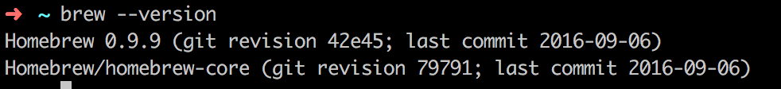
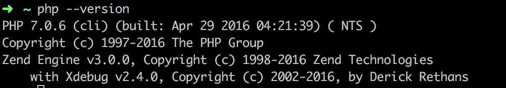
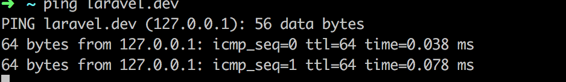
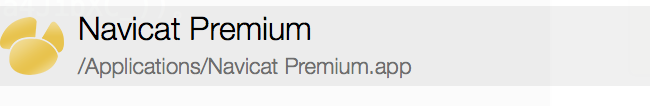
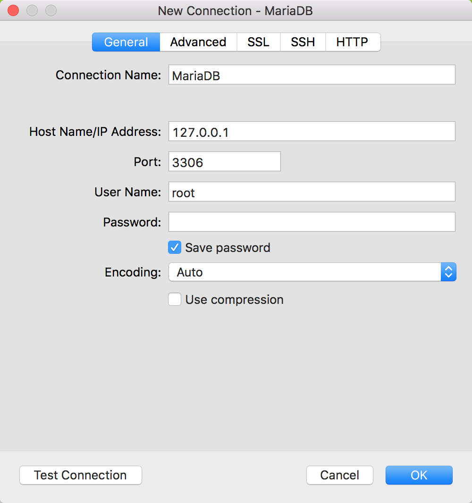
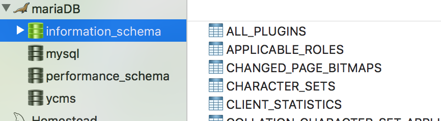
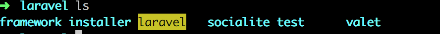
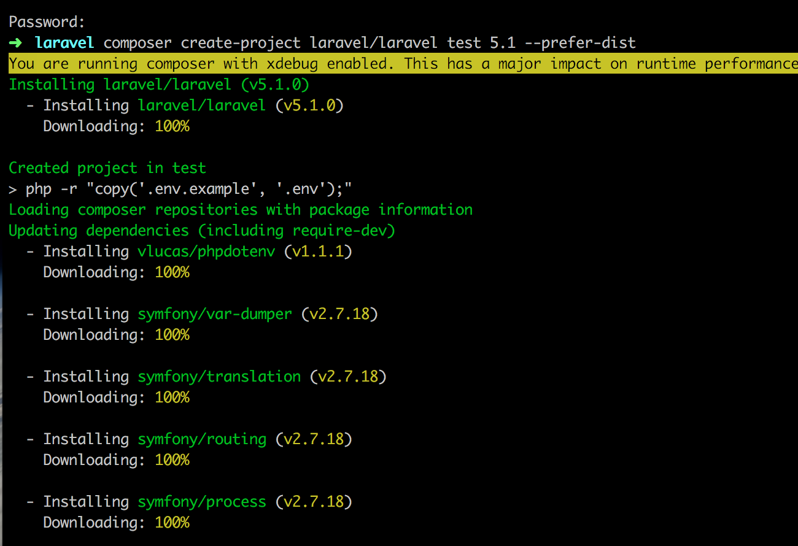
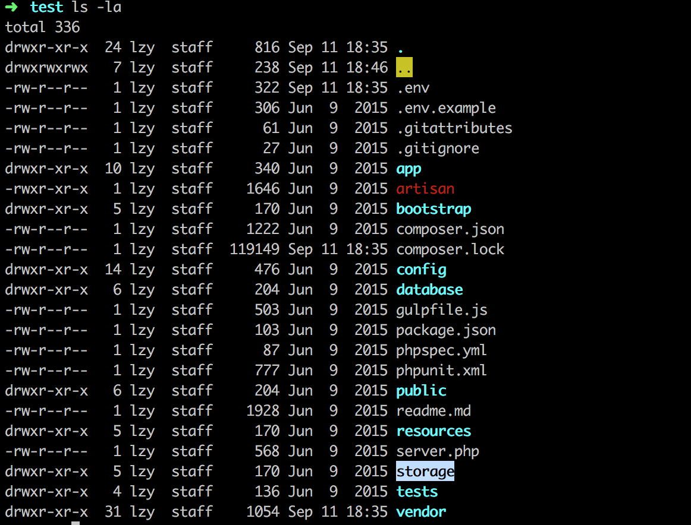
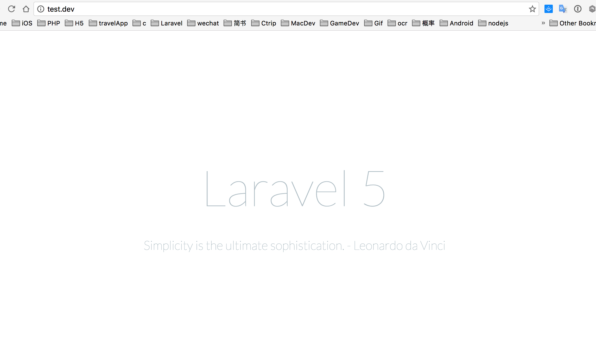

#安装Laravel5.1 Valet开发环境
>***本篇选择性的安装了`Laravel 5.1 LTS`版本 (LTS版本是官方长期支持维护版本，最低2年的官方Bug修复和维护升级支持)***
>>首先,这里介绍使用`Laravel`官方提供的`Valet`集成环境。`Valet`包扩了`Lumen`、
`Symfony`、
`Zend`、
`CakePHP 3`、
`WordPress`、
`Bedrock`、
`Craft`、
`Statamic`、
`Jigsaw`、
`Static HTML`这些集成模块，无需开发者自己配置，开箱即用。虽然`valet`是跟着`Laravel5.3`版本一起发布，但是也可以作为`Laravel5.1`的开发环境的。
>>
>>当然，除了`Laravel`提供的`Valet`环境之外，你也可使用`Homesead`虚拟机环境来进行`Laravel`开发。至于`Homestead`的环境配置你可以查看[官方文档](https://laravel.com/docs/5.3/homestead)或者查看 这篇 [离线安装Laravel5.1 Homestead开发环境]() 的简文。

##安装
>**环境需求**：系统`macOS X`、包管理器`Homebrew`
>>意思就是：
>>>首先你要有一台Mac,因为Valet现在只支持Mac系统。当然你要是有能力和时间折腾黑苹果来体验mac系统或者学习iOS开发的话，我也是很佩服的。大学时和室友一起装黑苹果的多少个日日夜夜，忆如往昔，历历在目。当然，如果你真的要装黑苹果，这里推荐远景
>>>
>>>其次就是mac上需要安装HomeBrew软件,当然你也可以移步Homebrew[官网安装教程](http://brew.sh/index_zh-cn.html)

***当然你也可以在mac控制台输入Homebrew安装命令***(下方`$`符号代表为命令行命令，`$`不需要输入)

```php
$ /usr/bin/ruby -e "$(curl -fsSL https://raw.githubusercontent.com/Homebrew/install/master/install)"
```

***安装好后查看Homebrew是否安装成功***

```
$ brew --version
```
安装成功如图所示

***安装PHP7.0***
>PHP7.0是2016年发布的PHP的最新版本，集成了最新的php特性。

```php
$ brew install homebrew/php/php70.
```
安装成功如图所示
***

***安装Composer***
>`composer`是php框架的三方库管理工具，和苹果公司OC语言的CocoaPods一样，是用来管理框架依赖包的工具。
>
>推荐你去Composer中国看Composer的安装教程[传送门](http://pkg.phpcomposer.com/), 当然你也可以看我下面摘自composer中国的教程。

*全局安装命令*（全局安装就是你在控制台输入composer就可以调用composer命令，局部安装这里不写了，觉得全局安装使用优势更大。当然你也可以去Composer中国去查看局部安装使用教程。）

```php
//控制台执行以下命令。这里可能需要翻墙，翻墙推荐：蓝灯（免费）、影梭(付费，每月大概10￥+)、GreenVPN（每月大概18￥）、
//下载安装脚本到当前目录
$ php -r "copy('https://getcomposer.org/installer', 'composer-setup.php');"
//上句命令完成后，执行安装过程
$ php composer-setup.php
//删除安装脚本
$ php -r "unlink('composer-setup.php');"
```

```php
//全局安装的本质就是把composer转移到系统环境去
$ sudo mv composer.phar /usr/local/bin/composer

//安装composer🇨🇳全量镜像
composer config -g repo.packagist composer https://packagist.phpcomposer.com

//查看composer版本
$ composer --version
```
安装成功如图所示
***

***安装Valet***
>我们使用composer命令安装Valet

```php
//通过composer下载valet
$ composer global require laravel/valet
//安装valet
$ valet install
//测试valet是否安装成功，输出
$ ping laravel.dev
```
安装成功如图所示

```php
//按control+C 结束ping命令

//启动valet
$ valet start
//停止valet
$ valet stop
```
***

***安装MariaDB（数据库）***
> `MariaDB`数据库管理系统是`MySQL`的一个分支，主要由开源社区在维护，采用`GPL`授权许可 `MariaDB`的目的是完全兼容`MySQL`，包括`API`和命令行，使之能轻松成为`MySQL`的代替品(摘自[MariaDB百度百科](http://baike.baidu.com/link?url=xGXi80VvwDXHkehiANoX7-uNSISnt1MP2S_-m7do7EOtGvsJyhgz_NNFhYJLYuv_c2khaTjSGTGwe0a4JibXC_))。

```php
//安装MariaDB
$ brew install mariadb
//启动MariaDB
$ brew services start mariadb
```
>使用Navicat连接数据库,[下载链接](http://www.pc6.com/mac/111878.html)

>mariadb默认地址：`127.0.0.1`，端口`3306`，用户名`root `, 密码为空` `
>如图
>
>连接成功，接下来就可以很方便的查看和管理数据库了。
>
***

***新建laravel工程***
>我们现在mac上新建网站的工程目录Site

```php
//新建目录
$ mkdir ~/Sites

//进入目录
$ cd ~/Sites

//使用composer命令新建名字为laravel的工程，这里使用laravel5.1版本
$ composer create-project laravel/laravel test 5.1 --prefer-dist

//启动当前工作目录映射到*.dev域名
$ valet park

```
>报错
>
>问题分析：/Users/mbp/.composer/cache/files/laravel/laravel目录权限不够
>
>**修改**/Users/mbp/.composer/cache/files/laravel/laravel目录权限
>>
```
//进入laravel目录
$ cd /Users/你的用户名/.composer/cache/files/laravel/
```

>>
```
//查看当前目录下是否含有laravel目录
$ ls 
```

>>
```
//修改laravel目录权限
$ sudo chmod -R 777 laravel
```


*再次*

```
//进入工程目录
$ cd ~/Sites

//使用composer命令新建名字为laravel的工程，这里使用laravel5.1版本
$ composer create-project laravel/laravel test 5.1 --prefer-dist

//启动当前工作目录映射到*.dev域名
$ valet park
```
>laravel安装完成


##启动当前test工程
>*进入test工程目录*

```
cd test
//查看text目录结构，文件权限
ls -la text
//如下图
```

>因为laravel要写入log日志文件到 storage📂内，所以修改storage文件目录权限为777

```
//修改test/storage文件目录权限为777
$ sudo chmod -R 777 storage
//如下图
```


>把当前目录加入到valet

```
$ valet park
```

>test工程目录下执行`php artisan key:generate`命令

```
$ php artisan key:generate
```
>谷歌浏览器访问：test.dev


***Success，接下来你就可以用PHPStorm进行开发了***


