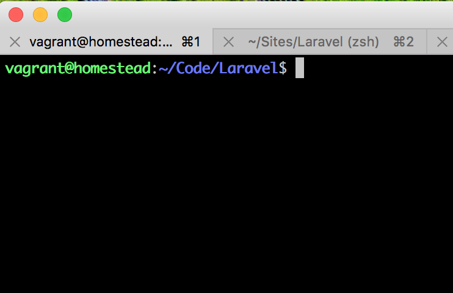
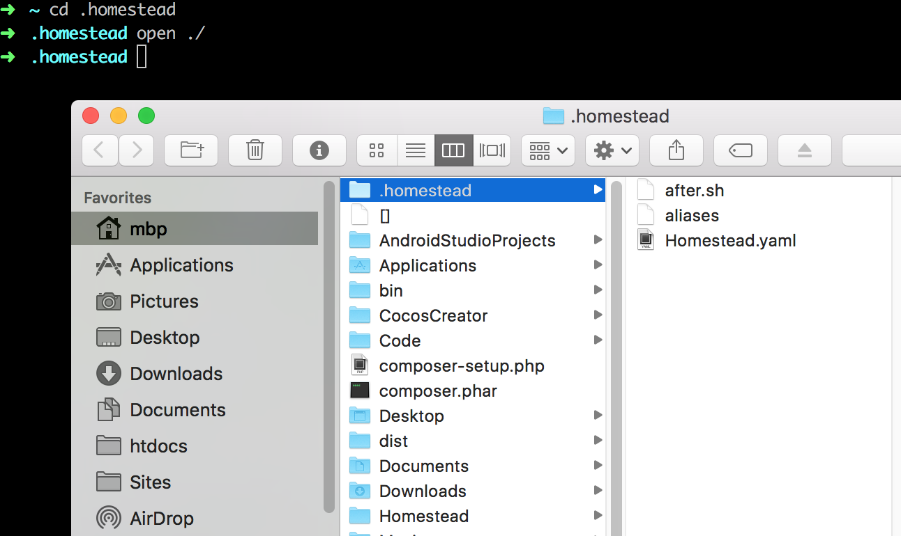
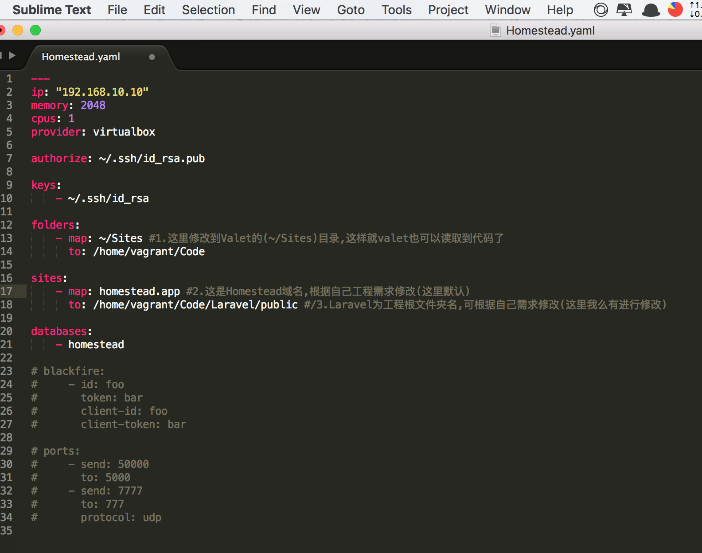

#使用Homestead和Valet同步调试开发Laravel
####起因
>优点:虽然`Homestead`的环境比较完善,但`valet`更新的`ngork`对于实时开发的优势不言而喻
>
>使用`$valet share`就可以把你的网站映射到互联网任何端口,可以随时把你的电脑作为服务器,而ngork官网也会为你随机分配一个二级域名,让你在全世界随时访问.

>***因为微信消息验证的及时性,而valet的即使公网域名分配让我们可以快速的进行微信开发***

####1.先安装配置Homestead
安装连接请看官网或者百度:
当然这里也提供离线安装Homestead方法[离线安装Homestead方法]()

>安装完成后在命令行输入命令

>`$cd .homestead`
>
>`$open ./`*输入该命令回车后finder会打开隐藏文件夹.homestead*
>
>下面配置`Homestead.yaml`
>
>使用普通的IDE如Sublime来修改Homestead.yaml(当然你也可以用vim命令行编辑器进行修改)
>

####2.安装Valet(详见官网连接[valet](https://laravel.com/docs/5.3/valet#installation))

