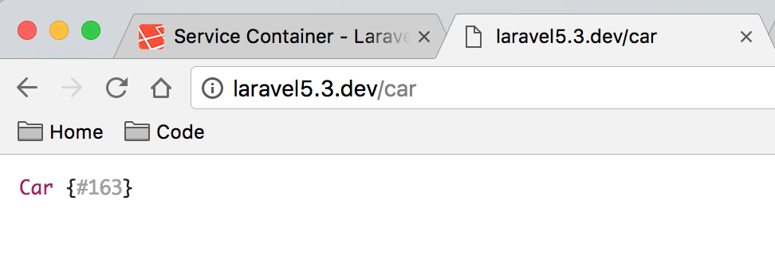
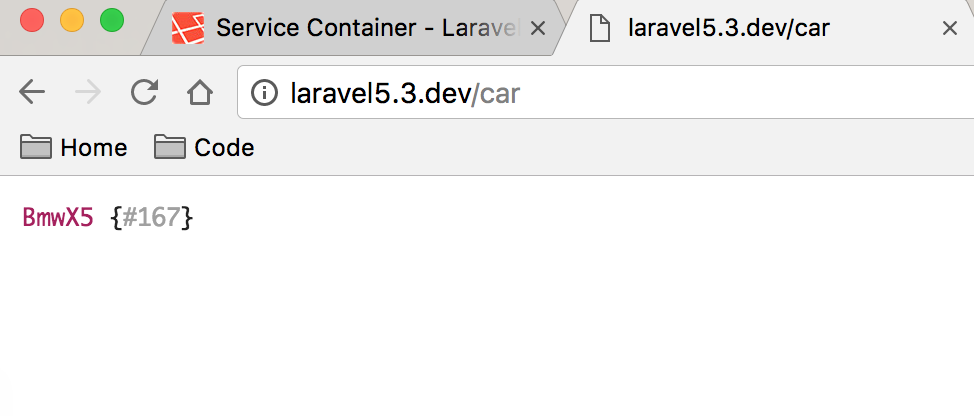
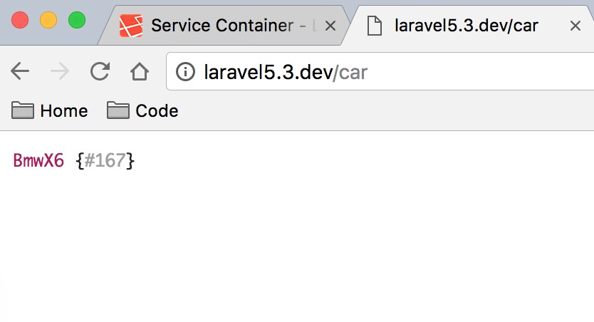
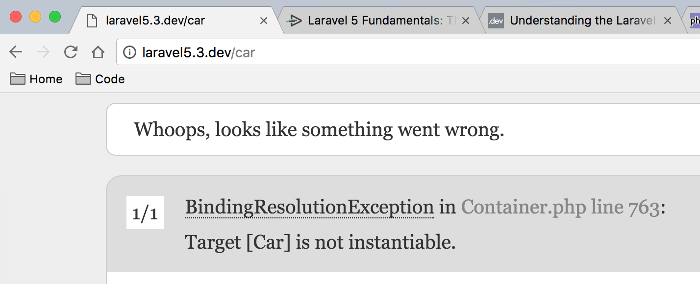
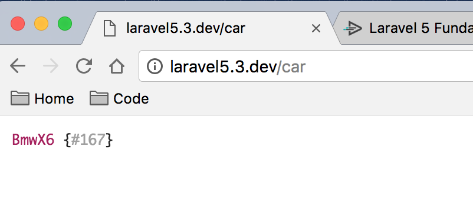

#Laravel Container 初探

>laravel 服务容器一直是我没有理解的地方，但官方文档说服务容器是 laravel 的核心。我也是崩溃，所以只能一点点的理解，下面记下过程中的点滴。

## Laravel 的服务容器是什么
官方文档写到 laravel 的服务容器是一个强大的依赖注入工具，但依然不明白具体含义。所以决定实验一下。

## 为什么要使用服务容器
Laravel 推荐使用服务容器(这个理由。。。哈哈😀)

## 怎么做，我们该怎么做
设计一个汽车类 Car，直接写到 routes 路由文件中，这样就可有及时的看到我们调试的代码了。下面将通过长常规方法实例化 Car 到使用服务容器来实例化 Car。

## 开始测试
>环境 MacOS Sierra 10.12.1，Valet，PHPStorm 开发环境
 
***以下代码直接写到 routes 路由中(laravel5.3 可以写到 routes/web.php 中)***

可以直接用类实例化实现：当然这是最常用的也是最普通的方法，当 Car 实例化的之后

```php
//汽车类
class Car {}

//常规调用
Route::get('/car', function () {
    //dd(new Car);
    //使用 new Car 不带 () 也一样可以实例化类
    dd(new Car());
});

```

下面在函数参数中传递 Car 实例变量

```php
//用户类
class Car {}

/*这里很神奇吧，明明没有实例化 Car，为什么可以打印出对象？
 *当然这里是使用了服务容器依赖注入，laravel 官方说使用的 PHP ReflectionClass 反射功能
 */
Route::get('/car', function (Car $car) {
    dd($car);
});
```
以上两段代码产生的效果是一样的，在浏览器访问 `/car` 路由可以看到：


##使用服务容器
>为了使用服务容器，我们来制作一个宝马车系的类吧

```php
//汽车接口
interface Car {}

//Bmw 宝马X5
class BmwX5 implements Car {}

Route::get('/car', function (BmwX5 $car) {
    dd($car);
});
```
接着访问 `/car` 路由：

OK!看起来依然可以正常运作。

>我们来想一想，如果我们想换宝马 X6 系列，怎么办呢？这里我们一般要在实例化 BmwX6 implements Car 然后把路由中的类替换。

```php
//汽车接口
interface Car {}

//Bmw 宝马X5
class BmwX5 implements Car {}

//Bmw 宝马X6
class BmwX6 implements Car {}

Route::get('/car', function (BmwX6 $car) {
    dd($car);
});
```



##绑定接口到实现

>仔细想想，这样是不是太麻烦了？这里就自然引出主角 laravel 服务容器。
laravel 服务容器我感觉其实是类绑定到接口的抽象容器。

```php
//汽车接口
interface Car {}

//Bmw 宝马X5
class BmwX5 implements Car {}

//注意这里和之前两段代码很大的不同之处在于这里 直接使用了接口类型作为 参数类型，其实这里是一个类型提示，但想想也不能被正常解析，毕竟仅仅只是契约接口，我们接着往下看：
Route::get('/car', function (Car $car) {
    dd($car);
});
```

这是为什么，上面报错日志中提示说 `服务容器绑定解析异常，目标 Car 类不能被实例化。
BindingResolutionException in Container.php line 763:` 
这在官方文档中也给出了合理的解释，官方文档中说，如果你的类没有实现任何接口的话，则不需要绑定服务容器。当然，我们这里是实现了接口的类，而且还使用了接口类型做参数提示，当然不行。

当前的 `class BmwX5 implements Car ` 实现了 Car 接口，所以这里我们应该绑定到服务容器了。

```php
//汽车接口
interface Car {}

//Bmw 宝马X5
class BmwX5 implements Car {}

//Bmw 宝马X6
class BmwX6 implements Car {}

//绑定接口到实现（服务容器一般在自己的 CustomProvider 中 Register() 方法中绑定，但这里为了方便说明问题就直接写在路由文件中了。）
App::bind('Car', function () {
    //当我们需要 Car 时，下面返回我们需要的 Car 实例，可以根据需求更换
    //return new BmwX5();
    return new BmwX6;
});

Route::get('/car', function (Car $car) {
    dd($car);
});
```



